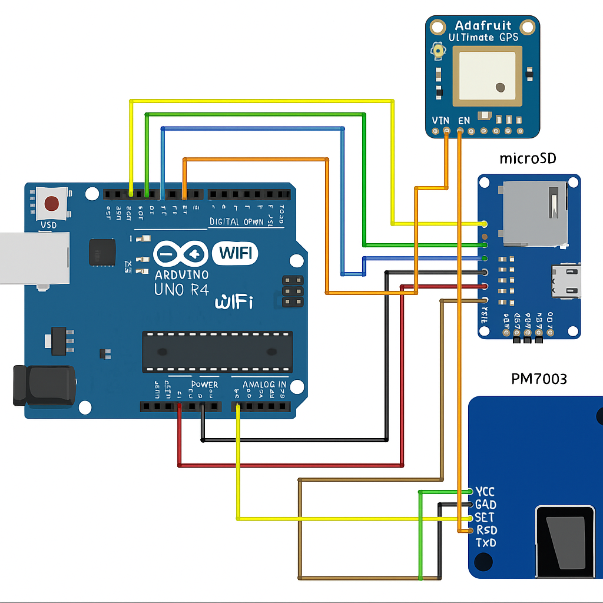

# Cartographie de la pollution à vélo

## Description du projet :
L'idée est la suivante : Lors d'un tour en vélo, notre système embarqué mesure le taux de particule fine à pas de temps régulier et récupère la position du point de mesure. Les données sont stockées sur une carte SD pour le temps du trajet. A la fin du tour, une fois que nous sommes connecté à notre réseau wifi, les données sont envoyés automatiquement à un serveur en ligne qui permet d'allimenter une carte intéractive qui cartographie le niveau de polution de la ville. On peut par la suite consulter cette carte actualisée par les données du tour en vélo sur notre site internet.

## Dépendances Python :
* pandas
* sqlite3
* numpy
* folium
* geopy

## Dépendances Arduino : 
* TinyGPSPlus.h
* SoftwareSerial.h
* WiFiS3.h
* SdFat.h
* SPI.h
* WiFiClient.h
* ArduinoHttpClient.h

## Description du module capteurs/Arduino
 Matériel :
 * Arduino Uno R4 Wifi
 * capteur de particules fines PMS7003
 * GPS Adafruit
 * lecteur MicroSD DFRobot

## circuit éléctronique

On branche le capteur PMS7003 sur les pins 2 et 7, et le GPS sur le hardware Serial1, soit sur les pins 0 et 1. le module SD est lui branché sur le pin 10. La carte arduino est alimentée par baterie transformé en 5 V.

## Map via Folium

On utilise Folium pour créer une map, via le fond d'OpenStreetMap. On superpose dessus des Layers, sous la forme de HeatMap, chaucun représentant un niveau de PM (1, 2.5 ou 10), en microgrammes par mètre cube. Ces données sont importées depuis la base de données du serveur. On réalise dessus une pré-sélection avant affichage, pour afficher la moyenne glissante sur 50m entre les points successifs. La distance est calculée via geopy.distance. 
